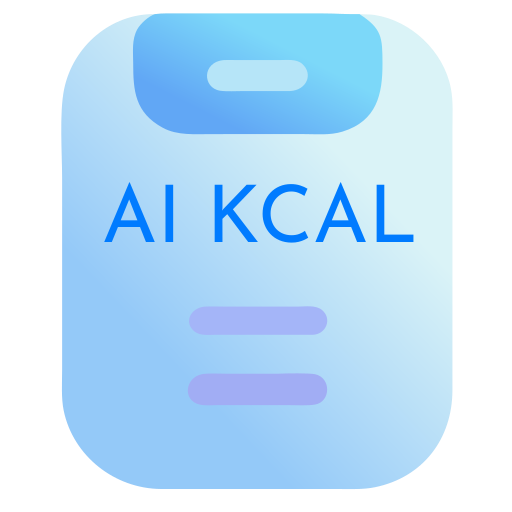

# AI Calorie Tracker

A premium AI-powered calorie tracking application with advanced nutrition analysis. Professional meal tracking with secure cloud storage and flexible subscription plans.



## 🌟 Features

- **AI-Powered Analysis**: Advanced nutritional analysis using OpenAI's latest models (GPT-4o, GPT-4o-mini)
- **Image Analysis**: Upload food photos for automatic analysis and nutritional breakdown
- **Secure Cloud Storage**: Your data is safely stored and synchronized across devices
- **User Authentication**: Secure Firebase authentication with email/password and Google sign-in
- **Subscription Plans**: Flexible pricing with free tier (10 analyses/month) to unlimited pro plans
- **Weight Tracking**: Monitor your weight progress with interactive charts
- **Usage Dashboard**: Track your API usage and manage your subscription
- **Favorites System**: Save frequently eaten meals for quick access
- **Data Portability**: Export and import your nutrition data
- **Custom AI Prompts**: Tailor analysis prompts for your specific dietary needs
- **PWA Support**: Install as a mobile app on any device
- **Dark Theme**: Modern, professional interface
- **Real-time Sync**: Data synchronized across all your devices
- **Professional Features**: Priority support, advanced analytics, and early access to new features

## 🏗️ Architecture

- **Frontend**: Next.js 15 with TypeScript
- **Authentication**: Firebase Auth
- **Database**: Cloud Firestore
- **Payments**: Stripe integration
- **AI Service**: OpenAI API (server-side)
- **Hosting**: Vercel (recommended)

## 🚀 Getting Started

### Prerequisites

- Node.js 18+
- Firebase project
- Stripe account
- OpenAI API key
- An OpenAI API key ([Get one here](https://platform.openai.com/api-keys))

### Installation

1. Clone the repository:

```bash
git clone https://github.com/tahaygun/ai-calorie-tracker.git
cd ai-calorie-tracker
```

2. Install dependencies:

```bash
npm install
```

3. Start the development server:

```bash
npm run dev
```

4. Open [http://localhost:3000](http://localhost:3000) in your browser

### Building for Production

```bash
npm run build
npm start
```

## 🔧 Technologies Used

- **Next.js 14**: React framework for production
- **TypeScript**: Type-safe code
- **Tailwind CSS**: Utility-first CSS framework
- **OpenAI API**: AI-powered food analysis with model selection
- **next-pwa**: Progressive Web App support
- **Local Storage**: Client-side data persistence

## 📱 PWA Features

- Installable on mobile devices
- Offline support
- Push notifications (coming soon)
- Background sync (coming soon)

## 🤖 AI Models

The app supports multiple OpenAI models:

- **GPT-4o-mini**: Recommended for most users - good balance of speed, cost and accuracy
- **GPT-4o**: Latest model with excellent nutritional analysis capabilities
- **GPT-3.5 Turbo**: Faster and less expensive option
- **GPT-4**: Original high-accuracy model
- **Custom Models**: Use your own fine-tuned models or other OpenAI models

You can change models in the Settings page, accessible from the main navigation.

## 🧠 Custom Analysis Prompts

The app now supports customizable analysis prompts:

- **Text Analysis Prompt**: Customize how the AI interprets your text descriptions
- **Image Analysis Prompt**: Tailor the AI's approach to analyzing food images
- **Prompt Export/Import**: Your custom prompts are included in data export/import
- **Default Restoration**: Easily reset to the app's optimized default prompts

Customize these in the Settings page under "AI Customization".

## 📷 Image Analysis

The app now supports food image analysis:

1. Click the camera icon in the meal input form
2. Upload a photo of your food
3. The AI will analyze the image and identify food items
4. Review and adjust the nutritional information as needed
5. Add the meal to your daily log

Tips for best image analysis results:

- Ensure good lighting and clear visibility of all food items
- Take photos from above to show all items on the plate
- For packaged foods, consider including the nutrition label in the image
- Images are compressed automatically for faster upload and processing

## ⚖️ Weight Tracking

Track your weight progress with the built-in weight tracker:

- **Visual Progress**: See your weight journey with an interactive chart
- **Target Weight**: Set and visualize target weight goals
- **Detailed History**: View and manage all your weight entries
- **Date Selection**: Record weights for specific dates
- **Add Notes**: Include optional notes with each weight entry
- **Data Integration**: Weight data is stored locally and exportable with your other app data

Access the weight tracker from the navigation menu and start monitoring your progress alongside your nutrition intake.

## 💾 Data Portability

The app now features data import and export capabilities:

- **Export Data**: Back up all your meal data, favorites, and settings
- **Import Data**: Restore your data on a new device or after clearing your browser
- **Privacy-Focused**: All data transfers happen locally with no server involvement

Access these features from the Settings page under "Data Management".

## 🔍 Debug Mode

For technical users or troubleshooting:

- **Token Usage Tracking**: View prompt and completion tokens used for API calls
- **Detailed Response Information**: See how the AI interpreted your food descriptions
- **Performance Optimization**: Useful for minimizing API costs or identifying issues

Enable Debug Mode in the Settings page.

## 🤝 Contributing

Contributions are welcome! Feel free to:

1. Fork the repository
2. Create a new branch (`git checkout -b feature/improvement`)
3. Make your changes
4. Commit your changes (`git commit -am 'Add new feature'`)
5. Push to the branch (`git push origin feature/improvement`)
6. Create a Pull Request

## 📝 License

This project is available under a dual-license model:

1. **GNU GPL v3 License** - For non-commercial use:

   - Free to use, modify, and distribute
   - Any modifications must be open-sourced
   - Perfect for personal use, educational purposes, and open-source projects

2. **Commercial License** - For business use:
   - Allows commercial use and integration
   - Keep modifications private
   - Priority support and updates
   - Contact [@tahaygun](https://github.com/tahaygun) for commercial licensing

For more details, see the [LICENSE](LICENSE) file.

## 🙏 Credits

- Created by [@tahaygun](https://github.com/tahaygun)
- Powered by [OpenAI](https://openai.com/)
- Built with [Next.js](https://nextjs.org/)

## 🔗 Links

- [Live Demo](https://ai-calorietracker.vercel.app)
- [GitHub Repository](https://github.com/tahaygun/ai-calorie-tracker)
- [Report Bug](https://github.com/tahaygun/ai-calorie-tracker/issues)
- [Request Feature](https://github.com/tahaygun/ai-calorie-tracker/issues)

## 📸 Screenshots

[Coming Soon]

---

Made with ❤️ by [@tahaygun](https://github.com/tahaygun)
